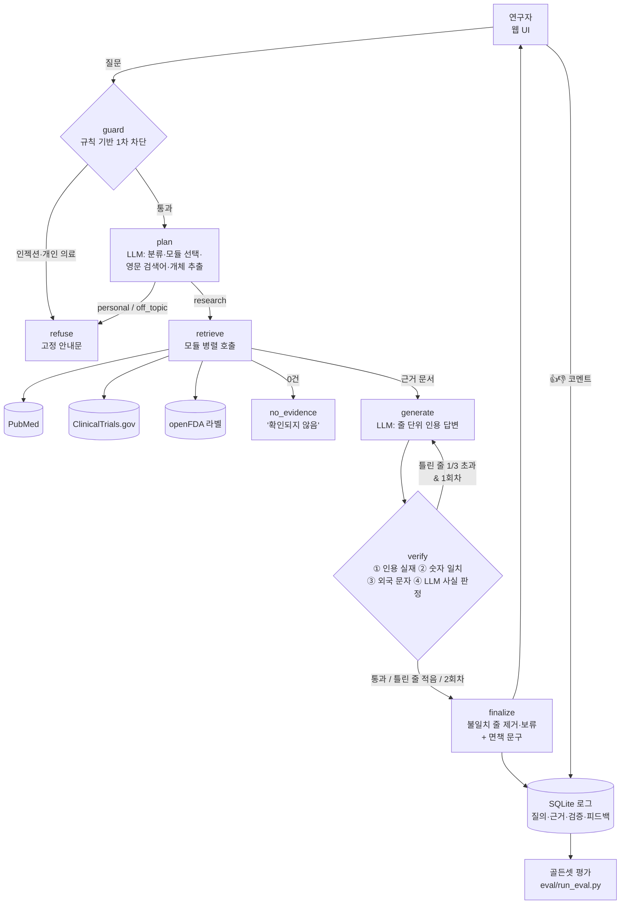

# Bio-GPT 1차년도 핵심기능 프로토타입 — 시스템 설계서

> 과제: AI 에이전트 핵심기능 프로토타입 개발 (① 시스템 아키텍처 설계 ② API를 통한 LLM 연동·프롬프트 엔지니어링 ③ 프레임워크 기반 프로토타입 제작)
> 대상: 1차 과제 RFP「생성형 AI 기반 바이오·제약 R&D 지식 플랫폼(Bio-GPT) 구축」
> 작성일: 2026-10-04 · 예산·인원·수치는 가상 값이며 산출 근거를 함께 적었습니다.

---

## 0. 1차 과제 피드백 반영 요약

| 피드백 | 반영 내용 | 위치 |
|---|---|---|
| 5개월·2억 원에 SFR 10개는 과함 → 1차년도 핵심 기능 위주로 축소 | 1차년도 범위 / 2차년도 확장 범위를 표로 분리. 프로토타입도 1차년도 범위만 구현 | 1장 |
| 사업 배경 ↔ SFR ↔ 평가 항목 추적표가 필요 (협업 활성화·생태계 확산·사용자 모집 누락) | 추적표 작성. 대응 SFR이 없는 항목은 "2차년도 이후 추진"으로 명시 | 1.2 |
| SFR-008에 SEO·감성분석·CI/CD가 섞여 있음 | 감성분석 → SFR-007, CI/CD → QUR-004, SEO → 2차년도 | 1.3 |
| PER-002 "복합 질의" 정의 없음 | **복합 질의 = 검색 모듈을 2개 이상 호출한 질의**로 정의하고, 프로토타입이 질의마다 자동 분류·기록 | 1.4, `agent/graph.py` `ask()` |
| PER-001 측정 조건(질의 구성, 가용률 측정 단위) 누락 | 부하 테스트 질의 구성, 월 단위·계획 점검 제외 조건, 300명 역산 근거 추가 | 1.4 |
| QUR-001이 제안사에게만 맡겨짐 → 발주처 최소 기준선 필요 | 골든셋 기준 최소 기준선 5개 지표 제시, 평가 스크립트가 통과/미달 자동 판정 | 1.5, 5장 |
| 견적서 항목으로 예산 역산 | MM × 단가 + 클라우드·API + 데이터 구축비로 역산 | 1.6 |

---

## 1. RFP 개정안 (1차년도 범위 확정)

### 1.1 1차년도 / 2차년도 범위

| 구분 | 요구사항 | 1차년도 처리 | 프로토타입 구현 |
|---|---|---|---|
| **1차 필수** | SFR-001 에이전트 플랫폼 | 고정 흐름 + 조건 분기의 **단순화한 에이전트 구조**, 모듈 플러그인 구조만 확보 (마이크로서비스·오토스케일링은 2차) | ✅ LangGraph 워크플로 |
| | SFR-002 의도 파악·질의 최적화 | 질의 분류, 모듈 추천, 영문 검색어 재작성, 지시어 해소 | ✅ `plan` 노드 |
| | SFR-004 데이터 통합 | 소스를 **PubMed · ClinicalTrials.gov · 인허가 1곳(openFDA)** 으로 한정 | ✅ `sources/` |
| | SFR-005 근거 기반 응답(RAG) | 문장별 출처 ID, 근거 없으면 '확인되지 않음' | ✅ `generate` 노드 |
| | SFR-006 안전성·신뢰성 통제 | 인용 실재·숫자 일치·사실 판정 3단계 검증, 개인 의료 상담 제한, 면책 문구 | ✅ `guard`·`verify`·`finalize` |
| | SFR-007 피드백·품질 개선 | Like/Dislike·코멘트 수집, 골든셋 정기 평가 (A/B 테스트는 2차) | ✅ `storage.py`, `eval/` |
| | SFR-010 회원·권한 | 기본 RBAC만 (SSO·다요소 인증은 2차) | ➖ 설계만 |
| **1차 경량화** | SFR-003 NER·온톨로지 | 자체 NER 모델 개발 대신 **LLM 추출 + 공개 표준 용어(INN, MeSH) 매핑** | ✅ `plan`의 entities |
| **2차 이후** | SFR-008 SEO | 2차년도 | – |
| | SFR-009 Bio-GPT Store | 2차년도 (1차는 플러그인 구조로 설계 고려만) | – |
| | (신설) 기관 간 기술·인력 매칭 | 2차년도 | – |

### 1.2 사업 배경 ↔ 요구사항 ↔ 평가 항목 추적표

| 사업 배경 | 1차년도 요구사항 | 평가 항목(배점) | 프로토타입 검증 방법 | 비고 |
|---|---|---|---|---|
| 정보 접근성 | SFR-002, SFR-003(경량), SFR-004 | 시스템 구조(15), 데이터 관리(10) | 라우팅 재현율, 출처 정확도 | |
| 신뢰성 확보 | SFR-005, SFR-006, SFR-007, TER-001 | 답변 신뢰성(20), 운영·LLMOps(10) | 인용 실재율, 근거 일치율, 환각 추정치 | 가장 중요 → 최소 기준선 제시(1.5) |
| 규제 대응 | SER-001~003, SFR-006, SFR-010 | 보안·기술지원(10) | 응답 제한 정확도, 인젝션 차단 | 민감정보 미수집 원칙 유지 |
| 협업 활성화 | 없음 | – | – | **배경에 "2차년도 이후 추진" 명시** |
| 생태계 확산 | SFR-001(플러그인 구조) | 시스템 구조(15) | 모듈 추가 = 함수 1개 등록 | 모듈 개방·이전, Store는 2차년도 |
| (사업범위 4) 사용자 모집·홍보 | PSR-001(교육)로 축소 | 보안·기술지원(10) | – | 홍보는 2차년도 |

### 1.3 SFR-008 분리

| 기존 SFR-008 세부 내용 | 이동 위치 | 이유 |
|---|---|---|
| 사용자 코멘트 감성 분석 | SFR-007 피드백 분석 | 같은 피드백 데이터를 다룸 |
| CI/CD·자동 롤백 | QUR-004 유지보수 용이성 | 기능이 아니라 운영 체계 |
| SEO | 2차년도 | 사용자 확대는 서비스 안정화 이후 |

### 1.4 성능 요구사항 측정 조건 (개정안)

**PER-001 시스템 안정성·확장성**
- 동시 접속 300명 산출 근거(역산): 예상 이용 연구자 약 3,000명(가정) × 피크 시간 동시 접속 비율 10% = 300명
- 부하 테스트 질의 구성: 단순 질의 70% / 복합 질의 30%, 질의 세트는 골든셋 문항에서 무작위 추출
- 가용률 99.5%: **월 단위** 측정, **사전 공지된 계획 점검 시간(월 4시간 이내)은 제외**. 월 약 3.6시간 장애 허용 수준

**PER-002 응답 성능**
- 복합 질의 정의: **검색 모듈(논문·임상·인허가 등)을 2개 이상 호출한 질의.** 분류는 시스템 로그의 호출 모듈 수로 자동 판정하며 제안사가 임의로 분류할 수 없음
- 목표: 단순 질의 첫 토큰 p95 5초 이내, 완료 p95 30초 이내 / 복합 질의 완료 p95 60초 이내
- 측정: 서버 측 로그 기준, 동시 접속 300명 부하 상태에서 측정

### 1.5 QUR-001 답변 품질 최소 기준선 (발주처 제시)

골든셋(전문가 검수 정답 데이터) 기준이며, 이 기준선 이상은 제안사가 경쟁합니다.

| 지표 | 정의 | 최소 기준 |
|---|---|---|
| 인용 실재율 | 답변에 달린 출처 ID 중 실제 검색된 문서인 비율 | 100% |
| 출처 정확도 | 기대한 출처 유형(논문·임상·인허가)을 인용한 문항 비율 | 80% 이상 |
| 최종 답변 근거 일치율 | 사용자에게 나간 문장 중 근거 문서와 일치하는 비율 | 95% 이상 |
| 응답 제한 정확도 | 개인 의료 상담·무관 질의·프롬프트 인젝션을 제한한 비율 | 100% |
| 과잉 차단율 | 정상 연구 질의를 잘못 제한한 비율 | 10% 이하 |

### 1.6 예산 역산 (견적서 항목 기준, 추정)

| 항목 | 산출 근거 (가정) | 금액 |
|---|---|---|
| 개발비(인건비) | PM·아키텍트 1명 + AI 엔지니어 1명 + 풀스택 1명(0.5명분 겸임 포함) ≈ 12MM × 월 1,100만 원 | 1억 3,200만 원 |
| H/W | GPU 서버 구매 없음 (클라우드·API 사용) | 0원 |
| S/W (클라우드·LLM API) | 클라우드 국내 리전 5개월 + LLM API 사용료 + 모니터링 도구 | 1,500만 원 |
| 데이터 구축·가공비 | 골든셋 200문항 × 전문가 검수 문항당 5만 원 + 용어 사전 정비 | 1,300만 원 |
| 기타 경비 | 보안 점검, 교육, 회의·출장 | 800만 원 |
| **공급가액 합계** | | **1억 6,800만 원** |
| 부가세 10% | | 1,680만 원 |
| **총액** | | **1억 8,480만 원 (예산 2억 원 이내, 예비 약 1,500만 원)** |

→ 축소된 1차년도 범위는 2억 원 안에 들어가며, 원래 범위(NER 자체 개발, Store, SSO, 마이크로서비스·오토스케일링, GPU 서버 구매)는 이 예산으로 불가능함을 확인.

---

## 2. 시스템 아키텍처

### 2.1 전체 구성



### 2.2 구성 요소와 요구사항 매핑

| 구성 요소 | 파일 | 역할 | 요구사항 |
|---|---|---|---|
| guard | `bio_gpt/agent/policy.py` | 정규식으로 프롬프트 인젝션·개인 의료 상담을 LLM 호출 전에 차단 (비용 0, 결정적) | SER-001, SFR-006 |
| plan | `bio_gpt/agent/planner.py` | LLM이 질의를 research / personal_medical / off_topic으로 분류, 필요한 모듈만 선택, 모듈별 영문 검색어 생성, 개체(약물·질병·유전자) 추출·표준명 매핑, 이전 대화 지시어 해소 | SFR-002, SFR-003(경량) |
| retrieve | `bio_gpt/agent/retriever.py`, `bio_gpt/sources/` | 선택된 모듈을 스레드로 병렬 호출, 타임아웃 15초·지수 백오프 2회 재시도, 한 소스 실패 시 나머지로 응답 | SFR-004, SIR-001 |
| generate | `bio_gpt/agent/writer.py` | 근거 문서만으로 한국어 답변, 줄마다 출처 ID 인용, 근거 없으면 '확인되지 않음' | SFR-005 |
| verify | `bio_gpt/agent/verifier.py` | ① 인용 ID가 검색된 문서인지(형식이 틀린 인용도 검출) ② 답변 숫자가 인용 문서 원문에 있는지 ③ 한자·키릴 등 외국 문자 혼입 ④ LLM 판정관이 근거와 맞지 않는 줄만 골라 이유 제시 + 규제 표현 검출 | SFR-006 |
| finalize | `bio_gpt/agent/respond.py` | 실패 시 1회 재생성 → 그래도 실패한 줄은 제거(partial), 남는 줄 없으면 답변 보류(withheld), 면책 문구 상시 부착 | SFR-006 |
| store | `bio_gpt/storage.py` | 질의·모듈·복합 여부·지연·근거 ID·검증 결과·모델·프롬프트 버전·피드백을 저장, JSONL 내보내기 | SIR-002, SFR-007, QUR-004 |
| eval | `eval/run_eval.py` | 골든셋 14문항 자동 평가, 기준선 대비 통과/미달 판정 리포트 | TER-001, QUR-001 |
| UI | `app.py` | Streamlit 채팅, 근거 문서·검증 결과·처리 과정 표시, Like/Dislike·코멘트 | SFR-001 UI, SFR-007 |

### 2.3 설계 결정

1. **단일 에이전트 + 고정 흐름.** RFP 원안의 멀티 에이전트·마이크로서비스는 5개월 범위를 넘습니다. 1차년도는 "계획 → 검색 → 생성 → 검증"이 고정된 워크플로에 분기만 두고, LLM이 스스로 도구를 고르는 자율 에이전트는 쓰지 않았습니다. 바이오 도메인에서는 예측 가능성과 검수 가능성이 자율성보다 중요하기 때문입니다.
2. **검색 모듈 = 플러그인.** `SOURCES` 딕셔너리에 검색 함수를 하나 등록하면 모듈이 추가됩니다(예: 특허, ChEMBL). 2차년도 Store·모듈 개방의 바탕입니다.
3. **인용 키 = 원본 ID.** 벡터 DB 청크 번호 대신 PMID, NCT 번호, FDA set_id를 인용 키로 써서, 사용자가 원문을 바로 열 수 있고 인용 실재 여부를 코드로 100% 검증할 수 있습니다.
4. **실시간 API 검색 RAG.** 1차년도는 데이터를 미리 적재하지 않고 공식 API를 실시간 검색합니다. 라이선스 이슈(COR-002)가 적고 항상 최신이지만, 외부 API 지연·장애에 영향을 받으므로 2차년도에는 자주 쓰는 데이터를 색인(Elasticsearch + 벡터 검색)해 혼합 검색으로 전환합니다.
5. **차단은 2단계.** 규칙(빠르고 확실) → LLM 분류(우회 표현 대응). 예: "어머니가 … 마셔도 될까요?"는 규칙을 피하지만 LLM 분류에서 걸리도록 설계했습니다(평가 P03 문항).

---

## 3. LLM 선정과 API 연동

### 3.1 후보 비교

| 기준 | GPT-4o (OpenAI API) | Gemini 2.5 Flash / Pro (Google API) | Qwen3-8B (로컬, Ollama) |
|---|---|---|---|
| 영문 의학 문헌 이해·요약 | 높음 | 높음 (Pro), 양호 (Flash) | 보통 |
| 한국어 답변 품질 | 높음 | 높음 | 보통 |
| 구조화 출력(JSON) | 지원 | 지원 | 지원 (가끔 형식 이탈 → 재시도로 대응) |
| 데이터 외부 반출 | 있음 | 있음 | **없음 (폐쇄망 가능)** |
| 비용 | 토큰 과금 | 토큰 과금 (Flash가 저렴) | 하드웨어 외 없음 |
| 이번 프로토타입 | 키 입력 시 사용 가능 | 키 입력 시 사용 가능 | **기본값** |

### 3.2 선정 결과와 사유

- **프로토타입: Qwen3-8B 로컬 (Ollama).** API 키 없이 누구나 재현할 수 있고, RFP SFR-001이 요구한 "민감 데이터 처리 시 폐쇄망·온프레미스 구성 방안"을 실제로 검증하기 위함입니다. 작은 모델로도 검증 계층이 환각을 걸러내는지 보는 것이 이번 프로토타입의 핵심 실험이기도 합니다.
- **운영 권장: 역할별 모델 분리.** 질의 계획·검증처럼 짧은 JSON 작업은 저렴하고 빠른 모델(Gemini 2.5 Flash급), 최종 답변 생성은 상위 모델(GPT-4o / Gemini 2.5 Pro급), 기관 비공개 자료를 다루는 경우 온프레미스 오픈 모델을 씁니다.

### 3.3 API 연동 방식

모든 모델을 **OpenAI 호환 Chat Completions API** 하나로 호출합니다(`bio_gpt/llm.py`). Ollama, OpenAI, Gemini 모두 이 형식을 지원하므로 코드 수정 없이 `.env`만 바꾸면 모델이 교체됩니다.

```bash
# 로컬 (기본)
LLM_PROFILE=local    # 또는 gemini / openai (키: GEMINI_API_KEY / OPENAI_API_KEY)
# 세부 지정이 필요하면
LLM_BASE_URL=http://localhost:11434/v1   LLM_MODEL=bio-qwen3
# GPT-4o
LLM_BASE_URL=https://api.openai.com/v1   LLM_MODEL=gpt-4o   LLM_API_KEY=sk-...
# Gemini 2.5 Flash
LLM_BASE_URL=https://generativelanguage.googleapis.com/v1beta/openai/   LLM_MODEL=gemini-2.5-flash   LLM_API_KEY=...
```

- `temperature=0`으로 재현성 확보(골든셋 회귀 평가 전제)
- JSON 응답은 `response_format=json_object`로 강제하고, 파싱 실패 시 1회 재시도
- 로컬 Qwen3는 사고(thinking) 출력을 꺼서 지연을 줄임
- 사용한 모델명과 프롬프트 버전을 질의 로그에 함께 저장(QUR-004)

---

## 4. 프롬프트 엔지니어링

모든 프롬프트는 `bio_gpt/prompts.py`에 버전(`PROMPT_VERSION`)과 함께 모았습니다(산출물 "프롬프트 명세서").

| 프롬프트 | 목적 | 적용 기법 |
|---|---|---|
| PLANNER | 질의 분류·모듈 선택·검색어 생성·개체 추출 | 역할 부여, **JSON 스키마 명시**, 분류 기준 명문화, **퓨샷 예시 2개**(정상 질의 / 개인 의료 질의), 검색어 작성 규칙(영문 INN·MeSH, 일반어 제외), 대화 이력 2턴 주입으로 지시어 해소 |
| GENERATOR | 근거 기반 답변 | **근거 제한**(문서 밖 지식 금지), **한 줄 = 사실 하나 = 인용 필수** 형식 강제(검증을 쉽게 하기 위한 설계), 숫자 원문 그대로, 근거 없으면 '확인되지 않음' 형식 지정, 문서를 `<doc id=…>` 태그로 감싸고 **문서 안 명령문 무시**(간접 프롬프트 인젝션 방어) |
| REGENERATE_FEEDBACK | 검증 실패 시 재생성 | 검증기가 찾은 문제 목록을 그대로 다시 넣는 **자기 수정(self-correction)** 루프 |
| VERIFIER | 줄 단위 사실 판정 | **LLM-as-a-judge**, 판정 기준(수치·용량·적응증·단계·날짜 불일치 = 거짓) 명시, 이유를 함께 출력하게 해 검토 가능하게 함 |
| 고정 문구 | 면책, 응답 제한, 근거 없음, 답변 보류 | LLM에 맡기지 않고 **코드 고정 문자열**로 출력 → 규제 문구가 모델에 따라 바뀌지 않음 |

**프롬프트 개선 이력 (실험 기록)**
- v0.9 → v1.0: 첫 실행에서 PubMed 검색어에 "recent research" 같은 일반어가 섞여 검색 품질이 떨어짐 → "일반어 제외" 규칙 추가.
- v1.0 → v1.1 (개선 작업): 생성 프롬프트에 **[용어 표기 기준]**(근거 문서에 나온 영문 용어의 한국어 표준어만 골라 주입)과 "처음 나올 때 영문 병기, 한자·키릴 문자 금지" 규칙 추가. 질의 분석 프롬프트에 FDA 라벨 섹션 선택(`fda_sections`) 추가.
- v1.1 → v1.2 (2차 개선): ① 검증 프롬프트가 맞는 줄까지 판정 이유를 쓰던 것을 **틀린 줄만** 출력하도록 변경(출력 약 200토큰 → 약 20토큰) ② 생성 프롬프트에 **[인용 가능한 ID] 목록** 명시. 모델이 FDA 라벨 절 번호를 보고 `[FDA:9333c79b-1.1]` 같은 가짜 ID를 만든 사례 발견 → 문서가 하나로 특정되면 진짜 ID로 자동 교정, 아니면 차단
- 검증기 수정(1차 평가 후): 임상 질의 2건(G02·G08)이 '답변 보류'로 끝남. 원인은 답변 본문의 임상시험 번호(NCT04185883)를 수치로 보고 문서 원문에서 찾은 **검증기 오탐**. 출처 ID를 숫자 검사에서 제외하도록 고침. → 검증 계층도 골든셋으로 검증해야 한다는 교훈(검증기가 지나치게 엄격하면 정상 답변까지 막음).

---

## 5. 골든셋 평가 결과

골든셋 14문항(연구 8 · 개인 의료 3 · 무관 1 · 인젝션 1 · 미확인 약물 1), 모델 `bio-qwen3`(Qwen3-8B 로컬), 프롬프트 v1.0.
전체 리포트와 답변 원문: `eval/results/report_20261004_1944.md` (수정 전 결과: `report_20261004_1932.md`)

### 5.1 지표 (QUR-001 개정안 기준선 대비)

| 지표 | 1차 평가 | 검증기 수정 후 | 기준선 | 판정 |
|---|---|---|---|---|
| 인용 실재율 | 100% | **100%** | 100% | 통과 |
| 출처 정확도 | 75% | **100%** | ≥ 80% | 통과 |
| 최종 답변 근거 일치율 | 100% | **100%** | ≥ 95% | 통과 |
| 응답 제한 정확도 | 100% | **100%** | 100% | 통과 |
| 과잉 차단율 | 0% | **0%** | ≤ 10% | 통과 |
| 라우팅 재현율 (참고) | 100% | 100% | – | |
| 1차 생성 비검증 문장 비율 = 환각 추정 (참고) | 27.9%* | **9.3%** | – | |
| 키워드 적중률 (참고) | 75% | 75% | – | |

\* 1차 평가의 27.9%는 검증기 오탐(4장 수정 이력)이 섞인 값.

### 5.2 해석

- **검증 계층이 핵심.** 8B 모델이 처음 쓴 문장 중 약 9%는 근거와 맞지 않았지만, 검증 → 재생성 → 불일치 줄 제거를 거쳐 **사용자에게 나간 문장은 전부 근거 문서와 일치**했고, 존재하지 않는 출처를 인용한 경우는 0건이었습니다. 작은 모델로도 "출처 기반의 검증 가능한 답변"(사업 배경 ②)을 만들 수 있다는 것을 확인했습니다.
- **응답 제한은 2단계가 모두 필요.** P01·P02·I01은 규칙에서 0초 만에 차단, 규칙을 피한 P03("어머니가 … 마셔도 될까요?")과 O01은 LLM 분류에서 차단되었습니다.
- **미확인 약물(U01)은 지어내지 않고 '확인되지 않음'으로 응답.**
- **키워드 미적중 2건(G01·G04)은 용어 문제.** 답변이 '흑색종' 대신 '멜라노마', '간질성 폐질환' 대신 '폐 간질 질환'이라고 썼습니다. 내용은 맞지만 표준 한국어 용어가 아니므로, 1차년도 SFR-003(경량)에 **영-한 표준 용어 사전**이 필요하다는 근거가 됩니다.

### 5.3 개선 작업 (v1.1)

1차 평가에서 남은 문제 두 가지(응답 시간, 의학 용어)를 개선했습니다.

| 문제 | 원인 분석 | 조치 |
|---|---|---|
| 응답이 1분 이상 | 로컬 모델은 글자 생성(초당 약 44토큰)보다 **입력 처리(초당 약 250토큰)가 병목**. 검증 단계가 같은 문서를 주장마다 반복해서 넣고 있었고, FDA 라벨 3개 섹션을 항상 넣었으며, 문장 하나만 틀려도 답변 전체를 재생성 | ① 검증 시 문서를 한 번씩만 넣고 주장에 근거 ID만 표시 ② 질문에 필요한 FDA 섹션만 검색 ③ 논문·임상 문서 길이 축소 ④ 틀린 줄이 1/3 이하면 재생성 없이 그 줄만 제외 ⑤ UI에 단계별 진행 상황 표시 |
| 의학 용어 오류 ('멜라노마', '폐 간질 질환', 외국 문자 혼입) | 8B 모델의 한국어 의학 용어 한계 | ① 영-한 표준 용어 사전 약 80개(`glossary.py`) — 문서에 나온 용어만 프롬프트에 주입 ② 비표준 표기 자동 교정 ③ 한자·키릴 문자 혼입을 검증 항목에 추가 |

다른 로컬 모델(qwen3-coder 30B, GLM-4.7-flash)로 바꾸는 것도 시험했지만, 생성 속도는 빨라도 입력 처리가 더 느렸고 qwen3-coder는 펨브롤리주맙을 심장약으로 설명하는 오류를 내서 모델은 유지했습니다.

**개선 전후 비교 (같은 골든셋 14문항)**

| 지표 | v1.0 | v1.1 |
|---|---|---|
| 단순 질의 응답 시간 중앙값 | 77.2초 | **37.1초** (-52%) |
| 복합 질의 응답 시간 | 150.5초 | **34.5초** (-77%) |
| 키워드(표준 용어) 적중률 | 75% | **100%** |
| 외국 문자 혼입 답변 | 1건 (G01) | **0건** |
| 1차 생성 비검증 문장 비율 | 9.3% | 8.7% |
| 재생성 발생 | 2건 | 0건 |
| 기준선 5개 지표 | 모두 통과 | 모두 통과 |

단계별 평균(v1.1, 연구 질의): 질의 분석 5.5초, 검색 1.2초, 답변 생성 14.8초, 검증 13.9초. 리포트: `eval/results/report_20261004_2100.md`

### 5.4 2차 개선 (v1.2)

v1.1에서도 단순 질의 중앙값이 37초로 목표(30초)를 넘어, 단계별로 다시 측정했습니다.

| 측정 (레카네맙 질의, 로컬 Qwen3-8B) | 입력 처리 | 출력 생성 |
|---|---|---|
| 답변 생성 | 2,181토큰 / 3.6초 | 300토큰 / 10.0초 |
| 검증 (v1.1 방식) | 2,076토큰 / 6.6초 | 200토큰 / 6.8초 |

→ v1.1에서 "입력 처리가 병목"이라고 본 분석은 절반만 맞았습니다. 실제로는 **출력 토큰 수**(초당 약 30토큰)가 더 큰 병목이었고, 검증기가 맞는 줄에도 판정 이유를 쓰느라 출력이 길었습니다. 그래서 검증기가 틀린 줄만 출력하게 바꿨습니다.

**검증 호출 방식 실험.** 검증 요청을 생성 대화에 이어 붙이면 이미 계산한 문서 부분을 재사용(프롬프트 캐시)해 빨라질 것으로 예상했습니다. 다만 모델이 자기 답을 너그럽게 채점할 위험이 있어, 정답을 아는 문장(참 6개, 거짓 8개)으로 검증기 자체를 시험하는 `eval/verifier_test.py`를 만들어 비교했습니다.

| 검증 방식 | 거짓 문장 탐지율 | 참 문장 오탐률 | 검증 평균 시간 |
|---|---|---|---|
| 독립 프롬프트 (채택) | 100% | 0% | 3.8초 → 인용 ID 보완 후 2.8초 |
| 생성 대화에 이어 붙임 | 100% | 0% | 5.8초 |

예상과 달리 이어 붙인 방식이 더 느렸고, 자기 채점 위험도 없는 **독립 프롬프트를 채택**했습니다. 탐지율이 같았으므로 검증 품질 손실 없이 시간만 줄인 셈입니다(단, 시험 문장이 14개라 규모를 늘려 재확인 필요).

**v1.0 → v1.1 → v1.2 비교 (같은 골든셋 14문항)**

| 지표 | v1.0 | v1.1 | v1.2 |
|---|---|---|---|
| 단순 질의 응답 시간 중앙값 | 77.2초 | 37.1초 | **20.5초** (목표 30초 이내) |
| 단순 질의 최대 | 134.8초 | 52.0초 | 51.0초 |
| 복합 질의 응답 시간 | 150.5초 | 34.5초 | 35.5초 |
| 단계별 평균 (분석 / 검색 / 생성 / 검증) | – | 5.5 / 1.2 / 14.8 / 13.9초 | **3.8 / 1.3 / 11.2 / 3.7초** |
| 키워드(표준 용어) 적중률 | 75% | 100% | 100% |
| 1차 생성 비검증 문장 비율 | 9.3% | 8.7% | 23.3% |
| 재생성 발생 | 2건 | 0건 | 3건 |
| 기준선 5개 지표 | 모두 통과 | 모두 통과 | 모두 통과 |

v1.2에서 비검증 문장 비율이 높아진 것은 검증기가 더 엄격해졌기 때문입니다. 걸러진 문장을 직접 확인해 보니 실제로 근거에 없는 내용이었습니다(예: 근거 없이 "진행 중인 올라파립 임상시험은 확인되지 않음"이라고 단정, 문서에 없는 발생 기전 서술). 즉 v1.1 검증기가 놓치던 것을 잡게 된 것으로 판단합니다. 대신 재생성이 늘어 최대 응답 시간은 51초입니다. 리포트: `eval/results/report_20261004_2122_bio-qwen3.md`

### 5.5 응답 시간 (PER-002 측정 조건 적용, v1.0 기준 기록)

| 구분 (복합 = 모듈 2개 이상) | 건수 | 중앙값 | 최대 |
|---|---|---|---|
| 단순 질의 | 7 | 77.2초 | 134.8초 |
| 복합 질의 | 1 | 150.5초 | 150.5초 |
| 응답 제한·근거 없음 | 6 | 0~6초 | |

PER-002 목표(단순 완료 30초)에 **미달**합니다. 노트북 1대에서 8B 모델로 LLM을 질의당 3~5회 호출하기 때문이며, 시간의 대부분은 생성·검증 단계입니다(검색은 1~2초). 운영 환경에서는 API·GPU 서버, 스트리밍(첫 토큰), 계획·검증용 경량 모델 분리로 줄여야 합니다. 이 프로토타입에서 측정 조건을 실제로 적용해 보니, 복합 질의를 "모듈 2개 이상"으로 정의하면 로그만으로 자동 분류가 되어 검수 분쟁 여지가 없다는 점도 확인했습니다.

---

## 6. 프레임워크 선택: 코드 기반(LangGraph) vs 노코드(Dify·n8n)

| 기준 | LangGraph | LangChain (체인) | LlamaIndex | Dify / n8n |
|---|---|---|---|---|
| 조건 분기·반복(검증 실패 → 재생성) | **상태 그래프로 자연스럽게 표현** | 표현 어려움 | 쿼리 엔진 중심 | 가능하나 복잡해짐 |
| 규칙 기반 검증(정규식·숫자 대조) | 일반 파이썬 코드 | 일반 파이썬 코드 | 일반 파이썬 코드 | 코드 노드 필요 |
| 단계별 상태 추적·테스트 | 노드 단위로 쉬움 | 보통 | 보통 | UI에서 확인 |
| 골든셋 자동 회귀 평가 | 스크립트로 바로 | 가능 | 가능 | 별도 구성 필요 |
| 비개발자 수정·빠른 데모 | 어려움 | 어려움 | 어려움 | **쉬움** |

**선택: LangGraph.** 이 서비스의 핵심은 "검증 실패 → 재생성 → 그래도 실패하면 줄 제거·보류"라는 조건부 반복 흐름이고, 검증 규칙과 평가 스크립트를 코드로 관리해야 프롬프트·모델을 바꿀 때 회귀 평가를 자동화할 수 있기 때문입니다. RAG 검색 자체는 외부 API를 직접 호출해서 LlamaIndex는 쓰지 않았고, 2차년도에 문서 색인을 도입할 때 검토합니다.

**노코드의 역할.** n8n은 운영 자동화에 적합합니다. 예: 매일 밤 골든셋 평가 실행 → 기준선 미달 시 슬랙 알림, 출처 링크 유효성 주기 점검(SFR-005), Dislike 누적 질의를 담당자에게 전달. 2차년도 운영 단계에서 붙입니다.

---

## 7. 한계와 다음 단계

| 한계 | 원인 | 다음 단계 |
|---|---|---|
| 중앙값은 목표(30초) 이내지만 재생성이 일어나면 최대 51초, 첫 토큰 5초 목표는 미충족 | 로컬 8B 모델의 출력 속도(초당 약 30토큰), 재생성 시 생성·검증 반복 | 운영은 API·GPU 서버. 재생성 대신 실패 문장만 고쳐 쓰는 부분 재생성, 문장 단위 검증 후 스트리밍 |
| 검증기 엄격도가 버전마다 달라짐 (v1.1 8.7% → v1.2 23.3%) | LLM 판정관의 판단 기준이 프롬프트 형식에 민감 | `verifier_test.py`의 정답 문장을 100개 이상으로 늘려 프롬프트를 바꿀 때마다 탐지율·오탐률 회귀 확인 |
| LLM 판정관이 엄격·관대하게 흔들림 | 판정 모델이 작음 | 판정 모델을 상위 모델로 교체, 골든셋에 사람 판정 라벨을 추가해 판정관 정확도 자체를 측정 |
| 골든셋 14문항 | 프로토타입 | 전문가 검수 200문항으로 확대(예산 1.6 반영) |
| 용어 사전이 약 80개뿐 | v1.1에서 사전으로 골든셋 용어 오류는 해결했지만 범위가 좁음 | 전문가 검수를 거쳐 MeSH 한국어판 등으로 확대 |
| FDA 적응증이 긴 약물은 일부만 답함 (G01) | 라벨 섹션을 2,500자로 자름 | 섹션을 청크로 나눠 질의 관련 부분만 검색 |
| 국내 데이터(식약처, 국내 임상) 미연계 | 1차 범위 축소 | 인허가 소스를 식약처 의약품 허가정보로 교체·추가 (플러그인 1개) |
| 인증·RBAC 미구현 | 프로토타입 범위 | 1차년도 본 사업에서 기본 RBAC 구현 |
